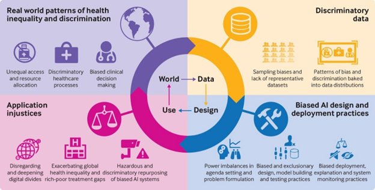
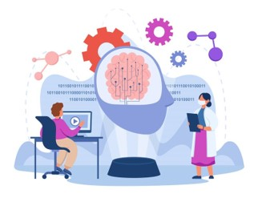

# Equality AI `responsible_mlops`

### Welcome to our GitHub repo!

[Equality AI (EAI)](https://equalityai.com/) is a public benefit corporation dedicated to closing the health disparity gap by assembling a Responsible AI framework into a MLOps Developer Studio (alpha coming soon Autumn 2022) that includes modernized, end-to-end machine learning (ML) operations (Ops) with functions that can be selectively incorporated to create various workflows designed to produce equitable, responsible models. </b>

We have released the technology behind our Responsible MLOPs Studio on GitHub as an open source ML software framework and tool, called `responsible_mlops`.

If you like what we're doing, give us a :star: and join our [EAI Manifesto!](https://equalityai.com/community/#manifesto)! 
 

## Fairness-based Machine Learning (Pre-processing)
Are you concerned that data and algorithmic biases lead to machine learning models that treat individuals unfavorably on the basis of characteristics such as race, gender or political orientation? Do you want to address fairness in machine learning but do not know where to start?   

<b>Figure 1:</b> An infographic showing the long term consequences of bias finding its way into our data in one example, the health sector (image from the British Medical Journal).

 Fairness-based ML offers a potential solution by incorporating bias mitigation methods and fairness metrics into the traditional end-to-end MLOps.  Fairness is a principle of Responsible AI, an emerging framework for how artificial intelligence systems should be developed, deployed, and governed to comply with ethics and laws. 

<b>Figure 2:</b> Full Responsible AI Framework.

 <b>Bias mitigation methods</b> are employed to address bias in data and/or machine learning models and <b>fairness metrics</b> are needed to mathematically represent the fairness or bias levels of a ML model. 

Many mitigation methods have been proposed in the literature, which can be broadly classified into the application of a mitigation method on the data set (<b>pre-processing</b>), in the model fitting (<b>in-processing</b>), and to the model predictions (<b>post-processing</b>). Since a typical mitigation method is generally designed to improve some specific fairness metric(s), it is crucial to select the appropriate mitigation methods once the fairness metrics are chosen. 

There are many different interpretations of what it means for an algorithm to be "fair". For binary classification problems, fairness metrics can be broadly classified into group fairness metrics and individual and counterfactual fairness metrics. Group fairness metrics can be further classified into parity-based metrics, confusion matrix-based metrics, calibration metrics, and prediction score-based metrics.  

However, Fairness-based ML comes with its own challenges: 
* Plethora of fairness metics and mitigation methods
* Little guidance for selecting the suitable fairness metric 
* Navigating trade-offs between different fairness metrics
* The most appropriate mitigation methods to use depending on the selected fairness metrics, the machine learning model used in the training, and other characteristics of the use case. 

To the best of our knowledge, no available solution exists in the literature attempting to tackle this problem. Thus, a systematic procedure for selecting the most suitable fairness notions and appropriate mitigation strategies for a specific machine learning based decision making system is highly desirable and necessary. 
 
## `responsible_mlops` 

 

We have conducted extensive literature review and [theoretical analysis]() on dozens of fairness metrics and mitigation methods. Theoretical properties of those fairness mitigation methods were analyzed to determine their suitability under various conditions to create our `responsible_mlops` open source ML software framework for a pre-processing workflow.  The main idea is to train the ML model on a "repaired" data set, and evaluate a Fairness metric to understand if mitigation enhances the fairness of the predictions. 

Using a healthcare application, we illustrate every step <b>(see steps 1-9 below)</b> of our fair machine learning framework. From choosing appropriate fairness metrics to determining suitable fairness mitigation strategies, from mitigation of fairness in data and models to fairness evaluation.
>1. Define Research Question
>2. Connect to Source Data
>3. Select Fairness and Mitigation Strategy
>4. Data Preparation
>5. Fit Prediction Model
>6. Compute Model Results and Fairness Score
>7. Run Mitigation
>8. Compute Model Results and Fairness Score After Mitigation
>9. Compare Model Results and Fairness Score Before and After Mitigation

To make our `responsible_mlops` easy to follow, our expert statisticians, academic partners and machine learning experts have likened these various workflows to something everyone can understand—[a recipe](). These recipes outline the “ingredients” you need and the exact steps to take to fit a fairness-based ML model. A recipe will not be showing any of the code but will walk through how we ran our case study, with explanations of conceptually executing each step or series of functions in our `responsible_mlops`. To follow along with the code, open the script [example_dataset_NHAMCS.R](https://github.com/EqualityAI/responsible_mlops/blob/main/examples/example_dataset_NHAMCS.R). 

>Using a healthcare application for hospital admission, our recipe will illustrate how we selected the fairness metric of Statistical Parity. We focus on three pre-processing methods to mitigate bias in the dataset, namely disparate impact remover, reweighing, and resampling. We assess the (un)fairness of a machine learning model trained on this dataset prior to applying bias mitigation. Finally, we assess the (un)fairness of the same machine learning model after bias mitigation is applied. By comparing the predictions before and after mitigation, we will be able to assess whether and to what extent the fairness of hospital admission predictions across different racial groups can be improved. Furthermore, the trade-offs between the accuracy and fairness of the machine learning model will be examined.  

## Function Highlights

Our plug and play functions are combined into two categories, 1) standardizing the series of discretionary judgment calls data scientists make into a series of best-practice MLOps functions and 2) providing guidance on selection and application of fairness metrics and mitigation methods. 

### Best-practice MLOps functions
* data_fetch()
* data_prepare()
* ml_method()
* ml_results()

### Fairness and Bias mitigation functions
<ins>Guidance on selection</ins> 
* fairness_tree_metric()
* mitigation_mapping_method()

 <ins>Application of metrics and methods</ins> 
* fairness_scores()
* bias_mitigation()

For additional resources, check [out our EAI library]() of Fairness research compiled by our statisticians, academic partners and machine learning experts. 

## Responsible AI Takes a Community
The connections and trade-offs between fairness, explainability, and privacy require a holistic approach to Responsible AI development in the machine learning community. We are starting with the principle of fairness and working towards a solution that incorporates multiple aspects of Responsible AI for data scientists and healthcare professionals. We have much more in the works, and we want to know—what do you need? Do you have a Responsible AI challenge you need to solve? [Drop us a line and let’s see how we can help!](https://equalityai.slack.com/join/shared_invite/zt-1claqpebo-MnGnGoqCM9Do~40HqbSaww#/shared-invite/email)

## Contributing to the project
Equality AI uses both GitHib and Slack to manage our open source community. To participate:

1. Join the Slack community (https://equalityai.com/slack)
    + Introduce yourself in the #Introductions channel. We're all friendly people!
2. Check out the [CONTRIBUTING](https://github.com/EqualityAI/responsible_mlops/blob/main/CONTRIBUTING.md) file to learn how to contribute to our project, report bugs, or make feature requests.
3. Try out the [`responsible_mlops`](https://github.com/EqualityAI/responsible_mlops)
    + Hit the top right "star" button on GitHub to show your love!
    + Follow the recipe above to use the code. 
4. Provide feedback on your experience using the [GitHub discussions](https://github.com/EqualityAI/respomsible_mlops/discussions) or the [Slack #support](https://equalityai.slack.com/archives/C03HF7G4N0Y) channel
    + For any questions or problems, send a message on Slack, or send an email to contact@equalityai.com.

