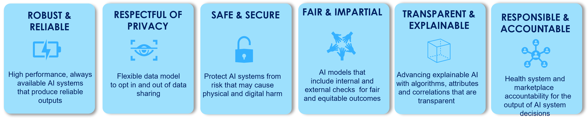

# Equality AI `responsible_mlops`

## Welcome to our GitHub repo!

[Equality AI (EAI)](https://equalityai.com/) is a public benefit corporation dedicated to closing the health disparity gap by assembling a Responsible AI framework into a MLOps Developer Studio (alpha coming soon Autumn 2022) that includes modernized, end-to-end machine learning (ML) operations (Ops) with functions that can be selectively incorporated to create various workflows designed to produce equitable, responsible models. </b>

We have released the technology behind our Responsible MLOPs Studio on GitHub as an open source ML software framework and tool, called `responsible_mlops’.

Give us a (put icon) star if you like our EAI Manifesto(https://equalityai.com/)!

## Fairness-based Machine Learning (Pre-processing)
Are you concerned that [data and algorithmic biases]() lead to machine learning models that treat individuals unfavorably on the basis of characteristics such as race, gender or political orientation? Do you want to address fairness in machine learning but do not know where to start?   




<details>
  <summary><font size="2"><i>More studies ...</i></font></summary>
  <hr/>
  </details>

Data scientists are the newest members of the healthcare team, and as such, the Hippocratic Oath applies:  First do no harm.  Developers must accept greater responsibility to ensure the ML models they develop do no harm.  Unfortunately, the typical tools and MLOps workflows available to developers have proven to be insufficient for this task. Responsible AI is an emerging framework that addresses this need and helps mitigate the potential risks of harm from AI and includes ethics, fairness, accuracy, security, and privacy.  
  


## `responsible_mlops` 
To make steps in our `responsible_mlops` easy to follow, our expert statisticians, academic partners and machine learning experts have likened these various workflows to something everyone can understand—a recipe. These recipes outline the “ingredients” you need and the exact steps to take to ensure you’ve cooked up a fair machine learning model. Our first recipe is a [fair preprocessing ML recipe]() and the main goal of this recipe is to repair the data set on which the model is run (pre-processing).</br>

<details>
  <summary><font size="2"><i>Learn more ...</i></font></summary>
  To create a fair preprocessing ML algorithm, you will need to incorporate two crucial functions into your ML workflow:  a mitigation method and a fairness metric.  Mitigation methods are employed to address bias in data and/or machine learning models and achieve fairness in output.  Fairness metrics are needed to mathematically represent the fairness or bias levels of a machine learning model. <br></br>

Let’s assemble the "ingredients" and get started!

**Ingredients**
* Your research question (or run our use case)
* Source data (or use our sample data)
* Fairness metric
* Mitigation method
* Integrated development environment (IDE), such as R studio
* R programming language, Python version coming soon
* Access to the Equality AI GitHub repository
</hr>
  </details>

[Sign up]() to hear when we release recipes that will tackle adjustments to the model (in processing) and the predictions (post-processing).

## Highlighted functions
<b>Data Fetch:</b> connect to source data (or use our sample data)</br>

<details>
  <summary><font size="4"> data_fetch() </font></summary></br>
  <b>Arguments:</b> dataset_name <br></br>

Takes in the parameter dataset_name and fetches the source data for this use case. The options available include <i><b>[National Hospital Ambulatory Medical Survey (NHAMCS)](https://ftp.cdc.gov/pub/Health_Statistics/NCHS/Dataset_Documentation/NHAMCS/)</b></i>. If you are connecting to your own data then be sure to specify the <i><b>target_variable, protected_var, and the priviledged_class</i></b>.
  
  ```
  dataset_name <- "NHAMCS"
  
  data_raw = data_fetch(data_name=dataset_name)) 
  ```
</details></br>

<b>Select Fairness and Mitigation Strategy:</b> `fairness_tree_metric` and `mitigation_method_mapping` functions that provide guidance on choosing appropriate fairness metrics and determining suitable fairness mitigation strategies </br>

<details>
  <summary><font size="4"> fairness_tree_metric() </font></summary></br>
  <b>Arguments:</b> fairness_tree_info <br></br>

Takes in the parameter fairness_tree_info. Fairness_tree_info includes EAI's fairness_tree.csv that has coverted this [recently published decision tree](https://arxiv.org/abs/2006.16745) into a table. When the `fairness_metric_tree()` is executed it will print a series of questions to the R console. For each question the user will be prompted to answer <i><b>(Y, y, Yes, or yes)</b></i> or No <i><b>(N, n, No, or no)</b></i>. As the user answers each question they will move through the decision tree until reaching the appropriate fairness metric to use.
  
  ```
  fairness_tree_info <- read.csv(file.path(getwd(),"config","fairness_tree.csv"), sep=',') 
  
  fairness_metric_tree <- fairness_tree_metric(fairness_tree_info)
  
  fairness_method <- fairness_metric_tree$fairness_metric
  print(paste0('Fairness metric: ',fairness_method))
  
  # Later the fairness_method parameter will be passed to the fairness_scores() to evaluate the fairness metric on the model.
  ```

<details>
  <summary><font size="2"><i> See example </i></font></summary></br>
  
  ```
> # Fairness metric selection
> fairness_tree_info <- read.csv(file.path(getwd(),"config","fairness_tree.csv"), sep=',')#, fileEncoding="UTF-8-BOM")
> fairness_metric_tree <- fairness_tree_metric(fairness_tree_info) 

[1] "QUESTION: Does your algorithm use an individual's sensitive variable information (intentional discrimination) to make a decision?"
[1] "EXAMPLE: For example, do you use a person's gender to make the decision?"
[1] "ANSWER: Yes/No"
 N

[1] "QUESTION: Do you want to assess if your population is disadvantaged by multiple sources of discrimination such as race, class, gender, religion, and other inner traits?"
[1] "EXAMPLE: For example, multiple sources would include accounting for all of a patient's attributes such as their gender, their age, etc... when measuring fairness"
[1] "ANSWER: Yes/No"
 N

[1] "QUESTION: Are there any standards or regulations enforced to avoid discrimination with regard to the decision being made?"
[1] "EXAMPLE: An example standard would be an internal organizational policy imposing diversity among employees such as hiring equally from sensitive variable groups."
[1] "ANSWER: Yes/No"
 N

[1] "QUESTION: Is there a reliable label or ground truth for the outcome of interest? Is there no historical or measurement bias?"
[1] "EXAMPLE: An example of areas where ground truths are available are disease prediction or hospital readmission. There is no ground truth when predicting whether a job  applicant is hired or college admission since the outcome in the training data is inferred by a human decision maker (subjective). Historical bias occurs when the data legitimately collected over time leads to unwanted outcomes and measurement biases occurs when features or labels are not measured accurately. "
[1] "ANSWER: Yes/No"
 N

[1] "QUESTION: Do you have features/explanatory variables in your data that provide information about the outcome variable while at the same time are correlated with the sensitive variable?              "
[1] "EXAMPLE: For example, a person's height may be an effective predictor for whether they can receive a kidney from a donor but also can be highly correlated with gender."
[1] "ANSWER: Yes/No"
 N
 
[1] "Fairness Metric: Statistical Parity"


  ```
  </details>
    </details> 
    
<details>
  <summary><font size="4"> mitigation_mapping_method() </font></summary></br>
  <b>Arguments:</b> mitigation_mapping_info <br></br>

Takes in the parameter mitigation_mapping_info. Mitigation_mapping_info works similar to the Fairness_tree_info, and includes [EAI's mapping between mitigation methods and fairness metrics](). When the `mitigation_mapping_method()` is executed it will print the recommended bias mitigation for the associated fairness metric into the R console. For this use case or the fairness metric of Statistical Parity, the mitigation methods recommended include <i><b>Disparate impact remover, Resampling, Reweighting</b></i>. The user will be prompted to select a mitigation method.
  
  ```
  mitigation_method <- mitigation_mapping_method(mitigation_mapping_info, fairness_method) 
  # Later the mitigation_method parameter will be passed to the bias_mitigation() to apply the bias mitigation method to the data.
  ```

<details>
  <summary><font size="2"><i> See example </i></font></summary></br>
  
  ```
> # Mitigation method mapping

> mitigation_mapping_info <- read.csv(file.path(getwd(),"config","mitigation_mapping.csv"), sep=',')
> mitigation_method <- mitigation_mapping_method(mitigation_mapping_info, fairness_method)

[1] "Mitigation methods recommended for Statistical Parity"
[1] "1 - Disparate Impact Remover"
[1] "2 - Resampling"
[1] "3 - Reweighting"
[1] "Select number between 1 - 3"
  ```
  </details>
    </details> </br>

<b>Data preparation</b></br>

<details>
  <summary><font size="4"> data_prepare_nhamcs() </font></summary></br>
  <b>Arguments:</b> .data, target_variable, method_options <br></br>

Takes in the parameter method options. The options available include method_missing=<i><b>'mi_impute'</b></i>, which allows for multiple imputation of missing values and max_iter = <i><b>is the number of iterations for each imputation.</b></i>.
  
  ```
  method_options<-list(method_prepare='Zhang', method_missing='mi_impute', max_iter=5) 
  
  data_clean <- data_prepare_nhamcs(data_raw$data, data_raw$target_variable, method_options) 
  ```
</details>


<details>
  <summary><font size="4"> train_test_split() </font></summary></br>
  <b>Arguments:</b> .data, target_variable, train_size <br></br>

Takes in the above parameters to split your train and test set data. The options available include train_size=<i><b>0-1</b></i>, and the default is set to 0.7 (i.e., 70% training data and 30% testing split).
  
  ```
  data_clean <- train_test_split(data_clean$data, target_var, train_size = train_data_size) 
  ```
</details>


<details>
  <summary><font size="4"> data_balancing() </font></summary></br>
  <b>Arguments:</b> .data, target_var, and method_balancing <br></br>

Takes in the above parameters to makes sure that the class frequencies of the target variable is balanced in the dataset. Two methods of data balancing are implemented: <i><b>down-sampling and up-sampling</i></b> (both are from the `caret` package). Down-sampling randomly subset all the classes in the training set so that their class frequencies match the least prevalent class. For example, suppose that 80% of the training set samples are the first class and the remaining 20% are in the second class. Down-sampling would randomly sample the first class to be the same size as the second class (so that only 40% of the total training set is used to fit the model). Up-sampling randomly sample the minority class to be the same size as the majority class.
  
  ```
  data_clean$training <- data_balancing(data_clean$training, target_var, method_balancing) 
  ```
</details></br>

<b>Fit prediction model</b></br>
 
<details>
  <summary><font size="4"> ml_method() </font></summary></br>
  <b>Arguments:</b> .data, target_var, ml_method, param_ml <br></br>

Takes in the above parameters to fit a prediction model or the ml_method (i.e., either a random forest or a gradient bosted machine model). The options for the prediction model (param_ml) includes the number of trees = <i><b>ntree</i></b>.
  
  ```
  ml_output = ml_model(data_clean, target_var, ml_method, param_ml) 
  ```
</details>

<details>
  <summary><font size="4"> ml_results() </font></summary></br>
  <b>Arguments:</b> true_class, pred_class, pred_prob <br></br>

Takes in the above parameters to fit a prediction model and stores the <i><b>TP, TN, FP, FN, precision, recall, F1, accuracy</i></b> into the ml_res variable.
  
  ```
  ml_res <- ml_results(true_class, pred_class, pred_prob) 
  ```
</details></br>

<b>Evaluate the Baseline Fairness of ML model</b></br>

<details>
  <summary><font size="4"> fairness_scores() </font></summary></br>
  <b>Arguments:</b> model, testing, target_var, param_fairness_metric <br></br>

Takes in the parameters above to evaluate the fairness metric of choice of the model.
  
  ```
  fairness_scores <- fairness_metric(ml_output$model, data_clean$testing, target_var, param_fairness_metric) 
  ```
</details></br>

<b>Run bias mitigation</b></br>

<details>
  <summary><font size="4"> bias_mitigation() </font></summary></br>
  <b>Arguments:</b> mitigation_method, training, target_var, param_bias_mitigation <br></br>

Takes in the parameters above to run a specified mitigation strategy on the data.
  
  ```
  training_data_m <- bias_mitigation(mitigation_method, data_clean$training, target_var, param_bias_mitigation) 
  ```
</details>


## Responsible AI Takes a Community
We are starting with fairness, and it doesn’t end there. We have much more in the works,  and we want to know—what do you need? Do you have a Responsible AI challenge you need to solve? Drop us a line and let’s see how we can help! 

## Contributing to the project
Equality AI uses both GitHib and Slack to manage our open source community. To participate:

1. Join the Slack community (https://equalityai.com/slack)
    + Introduce yourself in the #Introductions channel. We're all friendly people!
2. Check out the [CONTRIBUTING](https://github.com/EqualityAI/responsible_mlops/blob/main/CONTRIBUTING.md) file to learn how to contribute to our project, report bugs, or make feature requests.
3. Try out the [Responsible MLOPs Toolkit](https://github.com/EqualityAI/responsible_mlops)
    + Hit the top right "star" button on GitHub to show your love!
    + Follow the recipe above to use the code. 
4. Provide feedback on your experience using the [GitHub discussions](https://github.com/EqualityAI/respomsible_mlops/discussions) or the [Slack #support](https://equalityai.slack.com/archives/C03HF7G4N0Y) channel
    + For any questions or problems, send a message on Slack, or send an email to contact@equalityai.com.


## Authors


[Equality AI](https://equalityai.com/) is a public benefit corporation dedicated to helping data scientists close the health disparity gap by assembling a Responsible AI framework into tools that include modernized, end-to-end MLOps with functions that can be selectively incorporated to create various workflows designed to produced equitable, responsible models. <br></br>  
